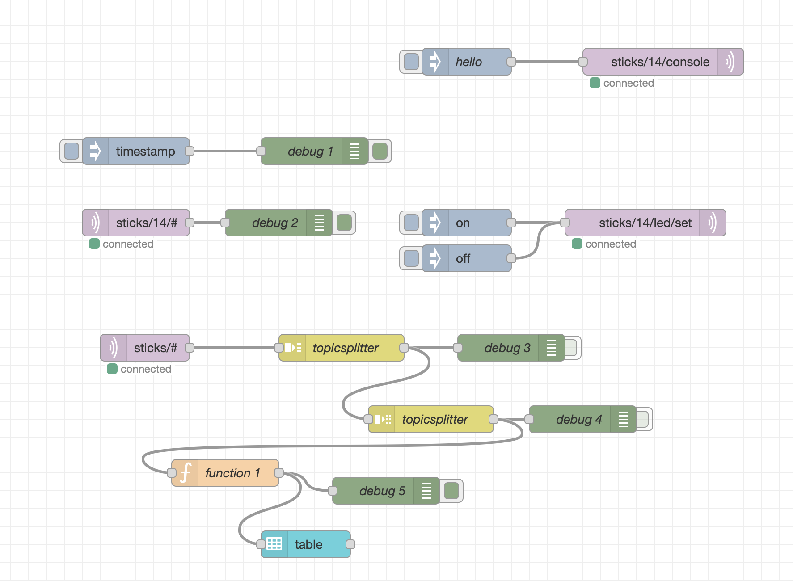
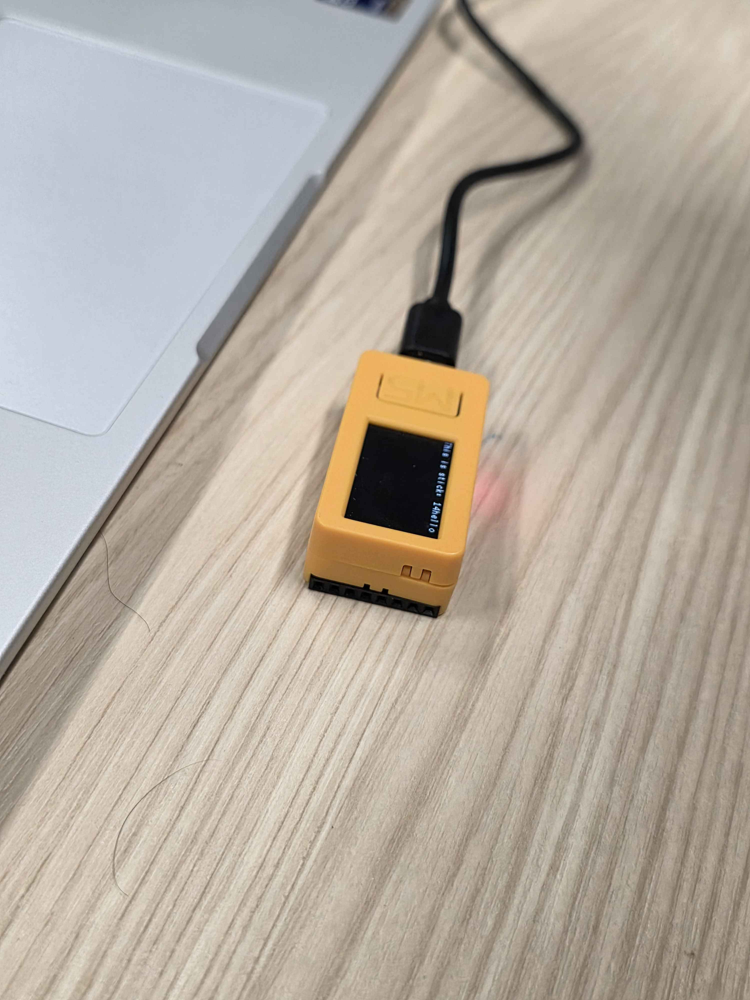
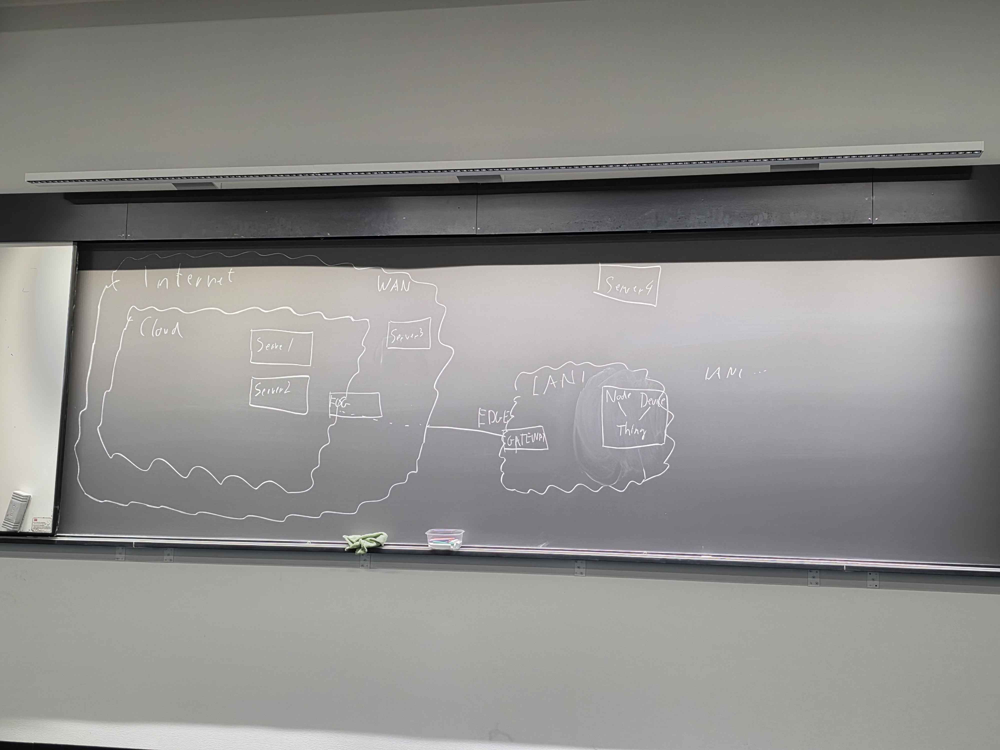

# Pictures for Module 1

I took some pictures of the workshop we did and of the final code we wrote. In the nodes, the `topicsplitter` parts were my attempt at tracking all topics with data moving. However, I didn't manage to get it to work since storing the data was difficult. I was told that we would be integrating with databases in one of the later labs.

## IoT Diagram

I also took a picture of the diagram that was drawn on the board.
