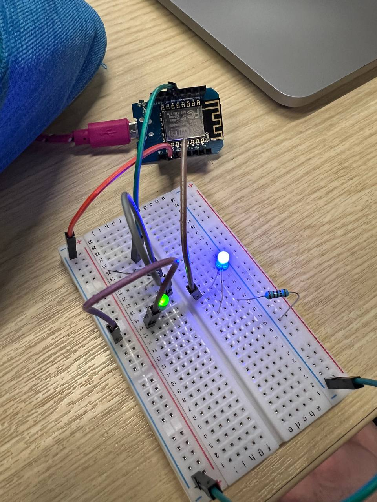
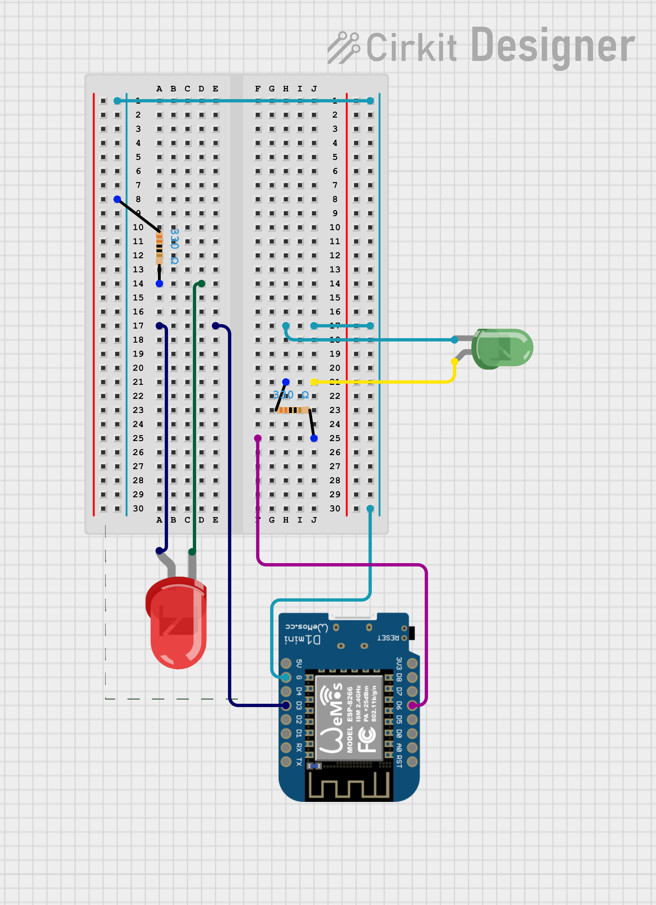
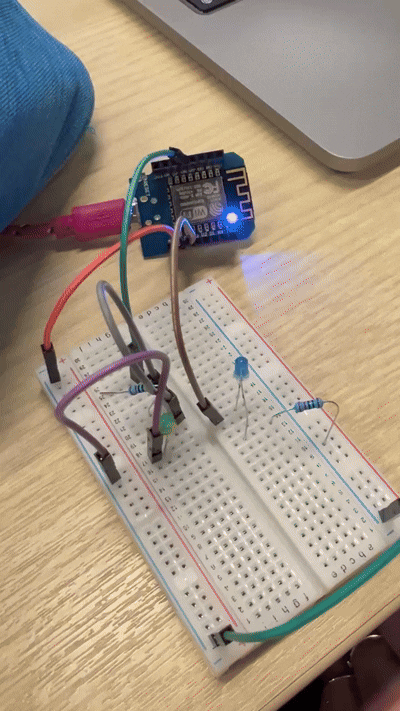
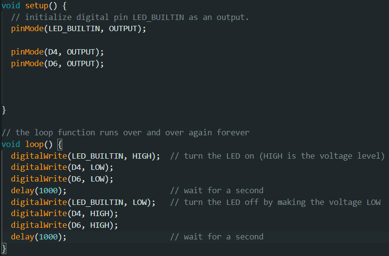
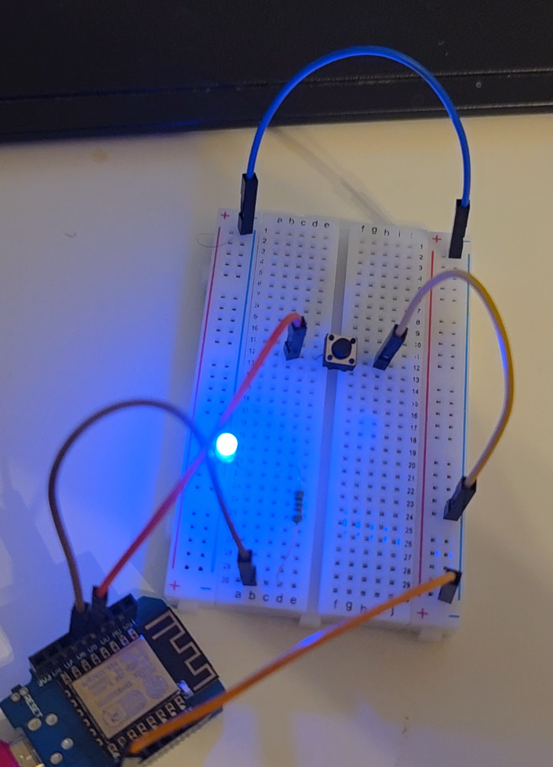
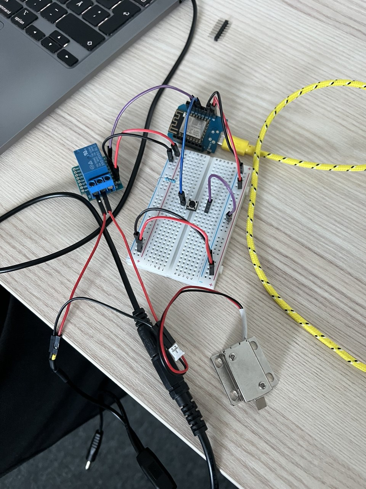

# Module 2

## Task 1

The hardware we took out is in the [Hardware](../Hardware/README.md) folder.

### What is an electric circuit?

A circuit is a closed loop through which electric current can flow. The three fundamental properties are voltage, current, and resistance. They are tied together by Ohm's Law: `V = I * R`. The circuit must form a complete, unbroken loop.

### What is a breadboard?

A breadboard is a reusable prototyping board that lets you build and modify electronic circuits without any soldering. Components and jumper wires are pushed into small holes and internal metal strips connect those holes together in a defined pattern.

### Describe a breadboard — two memorable features

1. Rows of 5 in the main area: In the central section the holes are grouped in rows of 5, all internally connected to each other. Any components inserted into the same row share an electrical connection — a bit like plugging things into the same strip of a power bar.
2. Continuous power rails along the edges: The long strips on each side (marked `+` and `−`) are connected all the way down their length. This means you only need to bring 5 V and GND to one point on each rail and power is available across the entire board.

### Color coding conventions for cables

- From AI
The most universal convention is **red for positive/power** and **black for ground (GND)**. A secondary convention that is widely followed is using **yellow or orange for signal lines**, making it visually easy to distinguish control/data wires from power wires at a glance.

### How do you wire an LED to 5 V?

1. Place a resistor in series between the 5 V supply and the anode (long leg) of the LED.
2. Connect the cathode (short leg) to ground.

### Describe an LED

A LED is a small semiconductor component that emits light when current passes through it in the correct direction. It has two legs: the anode(longer, positive) and the cathode (shorter, negative). LEDs come in many colors depending on the semiconductor material used, and they are highly energy-efficient compared to traditional bulbs.

### What is special about (light-emitting) diodes?

Diodes only allow current to flow in one direction — from anode to cathode. This makes them act like a one-way valve for electricity; if connected backwards, no current flows (and the LED produces no light). In a light-emitting diode, the semiconductor junction converts the energy of flowing electrons directly into photons, which is why they are so efficient — very little energy is wasted as heat.

### One thing that seemed unclear / very important

Without a resistor, most components will fry themselves very fast.

---

## Task 2

This task was executed by me.

One blue bag for keeping all your IoT parts
One big, one medium size breadboard
Dupont cables - about 20 of each type
2-5 Leds/Unicolor (2 pins)
2-5 resistors >150 Ohm (<1kOhm)
3 buttons
1 Wemos D1 Mini + 1 USB cables (Needed 2, but only grabbed 1 in class)
USB Charger (MH-KC24-4) + 12V Power-Supply + Y-cable

## Task 3

This task was executed by me. The implementation was quite simple as I have previous experience with embedded devices.
We added a 5V wire to `+`, GND wire to `-` and connected the LEDs in serial. To finish the circuit, the button had to be pressed down.



## Task 4

This task was done by my lab partner. It can be found at https://app.cirkitdesigner.com/project/d3a484c2-9bc9-45e4-ab98-e0bf14659a56



## Task 5

I added the 2 pins as outputs in the setup. Then I wired it together similarly to task 3, but instead of the 5V I used the pins, with D4 going to 1 LED and D6 to the other with them meeting up in the `-` rail to connect to GND. In the code, I set them to alternate on and off. This way one of the LEDs was blinking together with the on-board LED while the other was blinking asynchronously.





## Task 6

### What is a pull-up resistor and why is it useful?

When a switch or device is open, the resistor allows current to flow through itself to the signal line, raising that line's voltage to near VCC. When the switch closes (conducts to ground), it provides a low-resistance path that pulls the voltage down to near ground, overpowering the resistor's pull-up effect.

It's useful because otherwise undriven input can float between LOW and HIGH values. With a pull-up/pull-down resistor, there is always a known value.

In the `DigitalReadSerial` example, the `INPUT_PULLUP` mode is better because it defines clearly what the input will be instead of floating.

I rewrote it to create the LED toggle.

```
int LED_PROVIDER = D6;
int TOGGLE_BUTTON = D5;

bool LED_STATE = false;

void setup() {
  Serial.begin(9600);
  pinMode(LED_PROVIDER, OUTPUT);
  pinMode(TOGGLE_BUTTON, INPUT_PULLUP);
}

void loop() {
  int button_state = digitalRead(TOGGLE_BUTTON);
  Serial.println(button_state);
  if (button_state == 0) {
    LED_STATE = !LED_STATE;
    if (LED_STATE) {
      digitalWrite(LED_PROVIDER, HIGH);
    } else {
      digitalWrite(LED_PROVIDER, LOW);
    }
    // debounce
    delay(250);
    return;
  }

  delay(1);
}
```



## Task 7

It was very hard to understand where the signal pin on the relay was as it had a shield on it and google did not give any info. Eventually, I caved and asked AI, which suggested that it is most likely on D1. This ended up being correct.

The description of the circuit was also somewhat difficult to understand, but with some googling, I figured it out. Most of the work was done at home by me and we finished it together over the holidays.




## Task 9

Our partlist is in the [Hardware](../Hardware/README.md) folder.
We did not have the DS1820B temperature sensor, so we skipped that.

| Bus | Wires | Example Device | Wemos Pins |
|-----|-------|---------------|------------|
| GPIO | 1 per device | Relay, RGB LED | Any Dx |
| PWM | 1 per device | RGB LED | D5, D6, D7 |
| I2C | 2 shared | MPR121 | D1 (SCL), D2 (SDA) |
| I3C | 2 shared | basically none | D1, D2 |
| SPI | 3 shared + 1 CS each | MAX7219 LED matrix | D5/D6/D7 + D8 |
| UART | 2 crossed | NEO-6M GPS | TX→RX, RX→TX |
| RS-232 | 2 + MAX232 chip | PC serial port | TX, RX |
| RS-485 | 2 diff. + MAX485 chip | Modbus sensor | TX, RX, D3 (dir) |
| 1-Wire | 1 + 4.7kΩ pull-up | DS18B20 temp sensor | Any Dx |


## Reflection 2
[Reflection 2](/Reflections/ref02.md)