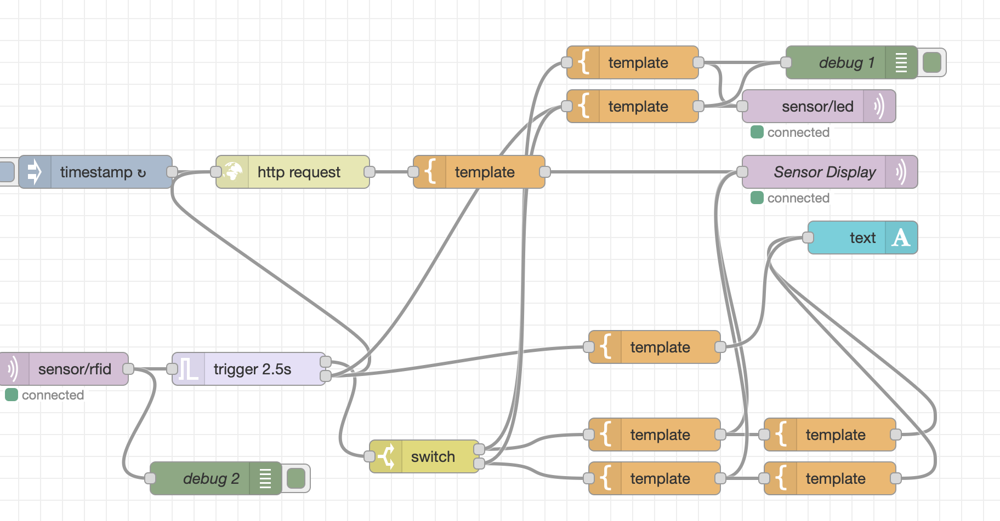

# Module 4

## Task 1

- [Broken code](code/task1/task1-broken.ino)
- [Fixed code](code/task1/task1-fixed.ino)

## Task 2

- [Broken code](code/task2/task2-broken.ino)
- [Fixed code](code/task2/task2-fixed.ino)

## Task 3

- [Broken code](code/task3/task3-broken.ino)
- [Fixed code](code/task3/task3-fixed.ino)

## Task 4

- [Broken code](code/task4/task4-broken.ino)
- [Fixed code](code/task4/task4-fixed.ino)

The broken code uses `delay(1000)` inside the interrupt service routine (ISR). This is problematic because ISRs should execute as fast as possible — calling `delay()` inside one blocks the entire processor, preventing other interrupts (including those used by WiFi and system timers) from firing. On the ESP8266 this causes a watchdog timer reset and crashes the board. The fix removes the `delay()` from the ISR and instead handles debouncing in the main `loop()` using `millis()`.

## Task 7

- [Node A code](code/task7/node_a/main.cpp)
- [Node B code](code/task7/node_b/main.cpp)

## Task 8

- [Code](code/task8/main.cpp)

## Task 9

- [Code](code/task9/main.cpp)

## Part 2

## Task 1

- [Code](code/part2/task1.rb)
- [Temperature code](code/part2/task1-2-temp.rb)
- [AC code](code/part2/task1-2-ac.rb)

## Task 2

- [LED RGB code](code/part2/led-rgb.cpp)
- [OLED with weather display code](code/part2/oled-with-weather-display.cpp)
- 

The node-red flow works by having a timestamp node that makes sure the weather is updated. When an RFID signal is read, it goes to a trigger node which makes sure the display is reset after 2.5s. The signal itself is sent to a switch which determines whether access is granted or no. This information is then passed onto both of LED strip and the display.
